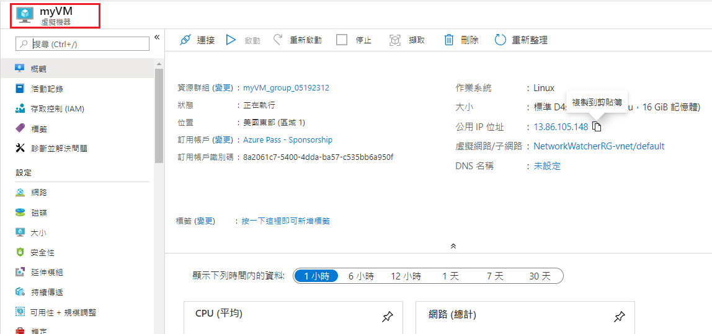
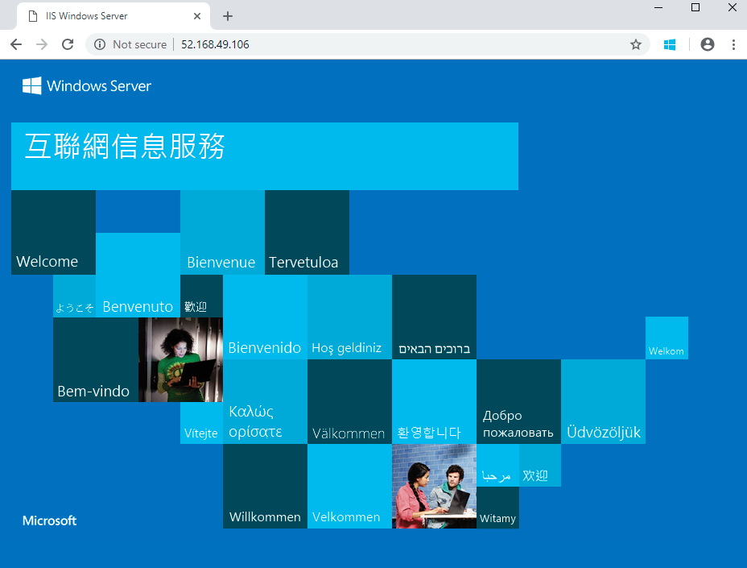

---
wts:
    title: '01 – 在入口網站中建立虛擬機器 (10 分鐘)'
    module: '模組 02 - 核心 Azure 服務 (工作負載)'
---
# 01 - 在入口網站中建立虛擬機器

在這個逐步解說中，我們將在 Azure 入口網站中建立虛擬機器，連線到虛擬機器，安裝 Web 伺服器角色，然後進行測試。 

**注意**：在這個逐步解說中請按一下 [資訊] 圖示，並花點時間閱讀顯示的內容。 

# 工作 1：建立虛擬機器 (10 分鐘)

在這個工作中，我們將建立一個 Windows Server 2019 資料中心 - Gen1 虛擬機器。 

1. 登入到 [Azure 入口網站 (https://portal.azure.com)](https://portal.azure.com?azure-portal=true)。

2. 從 [**所有服務**] 刀鋒視窗，搜尋並選取 [**虛擬機器**]，然後按一下 [**+ 新增**] 並選擇 [**+ 虛擬機器**]。

3. 在 [**基本**] 索引標籤中，填充下列資訊 (其他內容保留預設值)：

    | 設定 | 值 |
    |  -- | -- |
    | 訂用帳戶 | **選取您的訂用帳戶**|
    | 資源群組 | **myRGVM** (新增) |
    | 虛擬機器名稱 | **myVm** |
    | 位置 | **美國東部**|
    | 映像 | **Windows Server 2019 資料中心 - Gen1**|
    | 大小 | 標準 D2s v3|
    | 管理員帳戶使用者名稱 | **azureuser** |
    | 管理員帳戶密碼 | **Pa$$w0rd1234**|
    | 输入連接埠規則 - 允許選取連接埠 | **RDP (3389)** 和 **HTTP (80)**|
    | | |

4. 切換到 [網路] 索引標籤，並尋找 [**選取输入連接埠**]：

    | 設定 | 值 |
    | -- | -- |
    | 選取输入連接埠 | **HTTP (80)，RDP (3389)**|
    | | |

    **注意** - 驗證已選取連接埠 80 和 3389

5. 切換到 [管理] 索引標籤，並在其 [**監視**] 區段中選取以下設定：

    | 設定 | 值 |
    | -- | -- |
    | 啟動診斷 | **停用**|
    | | |

6. 保留其餘的預設值，然後按一下頁面底部的 [**檢閱 + 建立**] 按鈕。

7. 驗證通過後，按一下 [**建立**] 按鈕。從任意位置部署虛擬機器可能需要 5 到 7 分鐘的時間。

8. 您將在部署頁面並透過 [**通知**] 區域 (頂部功能表中的鈴圖示) 接收更新。

* **驗證連接埠 80 和 3389 已開啟**

# 工作 2：連線到虛擬機器

在這個工作中，我們將使用 RDP 連線到新的虛擬機器。 

1. 搜尋 **myVM**，並選取您的新虛擬機器。

    **注意**：您還可以使用部署頁面上的 [**前往資源**] 連結或 [**通知**] 區域中的資源連結。

2. 在虛擬機器的 [**概觀**] 刀鋒視窗上，按一下 [**連線**] 按鈕並選擇 [**RDP**]。

    ![[連線] 按鈕醒目提示的虛擬機器屬性的螢幕擷取畫面。](../images/0101.png)

    **注意**：下列說明告訴您如何從 Windows 電腦連線到 VM。在 Mac 電腦上，您需要一個 RDP 用戶端，比如 Mac 應用程式商店的遠端桌面用戶端；而在 Linux 電腦上，您可以使用開放原始碼 RDP 用戶端。

2. 在 [**連線到虛擬機器**] 頁面中，保留預設選項以透過連接埠 3389 連線公用 IP 位址，然後按一下 [**下載 RDP 檔案**]。

3. **開啟**下載的 RDP 檔案，然後在出現熒幕提示時按一下 [**連線**]。 

    ![[連線] 按鈕醒目提示的虛擬機器屬性的螢幕擷取畫面。 ](../images/0102.png)

4. 在 [**Windows 安全性**] 視窗中，選取 [**更多選擇**]，然後選取 [**使用其他帳戶**]。提供使用者名稱 (.\azureuser) 和密碼 (Pa$$w0rd1234)。按一下 [**確定**] 進行連線。

    ![[Windows 安全性] 對話方塊的螢幕擷取畫面，其中選取了 [使用其他帳戶]、使用者名稱 azureuser 並輸入了密碼。](../images/0103.png)

5. 您可能在登入過程中收到證書警告。按一下 [**是**] 或建立連線並連線到部署的 VM。您應該連線成功。

    ![證書警告對話方塊的螢幕擷取畫面，通知用戶不受信任的證書，並醒目提示 [是] 按鈕。 ](../images/0104.png)

恭喜！您已部署並連線到 Azure 中的 Windows 伺服器虛擬機器

# 工作 3：安裝 Web 伺服器角色並進行測試

在這個工作中，將在伺服器上安裝 Web 伺服器角色，並確保可以顯示預設 IIS 歡迎頁面。

1. 在虛擬機器上開啟 PowerShell 命令提示字元，方法是按一下 [**開啟**] 按鈕，鍵入 **PowerShell**，以滑鼠右鍵按一下 [**Windows PowerShell**]，然後在右鍵功能表中選取 [**以系統管理員身分執行**]。

    ![虛擬機器桌面的螢幕擷取畫面，其中按一下 [開啟] 按鈕並選取 PowerShell 然後醒目提示 [以系統管理員身分執行]。](../images/0105.png)

2. 透过在 PowerShell 命令提示字元中执行以下命令，在虛擬機器中安裝 **Web 伺服器**功能。您可以複製並貼上此命令。

    ```PowerShell
    Install-WindowsFeature -name Web-Server -IncludeManagementTools
    ```
  
3. 完成後，將出現一個提示，說明 [**成功**] 的值為 **True**。您無需重新啟動虛擬機器即可完成安裝。關閉 RDP 到 VM 的連線。

    

4. 回到入口網站，導覽回 myVM 的 **[概觀]** 刀鋒視窗，然後使用 [**按一下到剪貼板**] 按鈕複製 myVM 的公用 IP 位址，開啟新的瀏覽器索引標籤，將公用 IP 位址貼到 URL 文字方塊中，然後按 **Enter** 鍵瀏覽它。

    

5. 將開啟預設 IIS Web 伺服器歡迎頁面。

    

恭喜！您已經建立了一個可透過其公用 IP 位址存取的 Web 伺服器。如果要託管一個 Web 應用程式，則可以將應用程式檔案部署到虛擬機器，並將其託管在已部署的虛擬機器上以供公眾存取。


**注意**：為了避免額外的成本，您可以删除此資源群組。搜尋資源群組，按一下您的資源群組，然後按一下 [**删除資源群組**]。驗證資源群組的名稱，然後按一下 [**删除**]。監視 [**通知**] 以驗證删除是否成功完成。 
