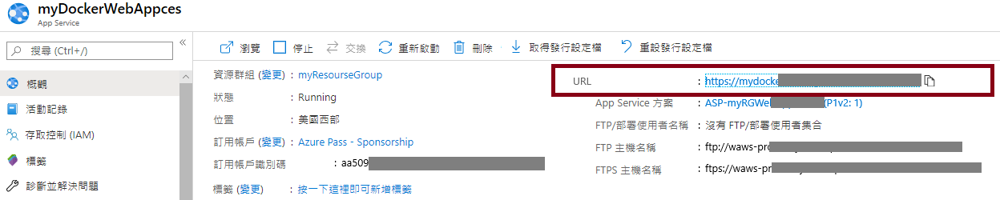

---
wts:
    title: '02 - 建立 Web 應用程式 (10 分鐘)'
    module: '模組 02 - 核心 Azure 服務 (工作負載)'
---
# 02 - 建立 Web 應用程式 (10 分鐘)

在這個逐步解說中，我們將建立一個執行 Docker 容器的 Web 應用程式。Docker 容器包含歡迎訊息。 

Azure App Service 實際上是四個服務的集合，所有這些服務都是為協助您託管和執行 Web 應用程式而組建的。這四個服務 (Web Apps、Mobile Apps、API Apps 和 Logic Apps) 看起來不同，但最終它們的操作方式都非常相似。Web Apps 是四個服務中最常用的，這是我們將在本實驗室中使用的服務。

# 工作 1：建立 Web 應用程式 

在這個工作中，您將建立一個 Azure App Service Web 應用程式。 

1. 登入到 [Azure 入口網站](http://portal.azure.com/)。 

2. 從 [**所有服務**] 刀鋒視窗，搜尋並選取 [**應用程式服務**]，然後按一下 [**+ 新增、+ 建立、+ 新建**]

3. 在 [**Web 應用程式**] 刀鋒視窗的 [**基本**] 索引標籤上，指定以下設定 (將 Web 應用程式名稱中的 **xxxx** 替換為字母和數位，以便名稱全域唯一)。保留其他所有內容的預設值，包括應用程式服務計畫。 

    | 設定 | 值 |
    | -- | -- |
    | 訂用帳戶 | **使用提供的預設值** |
    | 資源群組 | **建立新資源群組**|
    | 名稱 | **myDockerWebAppxxxx** |
    | 發佈 | **Docker 容器** |
    | 作業系統 | **Linux** |
    | 區域 | **美國東部** |
    
    **注意** - 請記得變更 **xxxx**，以便您的 Web 應用程式名稱是唯一的。

4. 按一下 [**下一步 > Docker**]，並設定容器資訊。  

    | 設定 | 值 |
    | -- | -- |
    | 選項 | **單個容器** |
    | 映像來源 | **Docker 中樞** |
    | 存取類型 | **公用** |
    | 映像和標籤 | **microsoft/aci-helloworld** |
    
 **注意**：啟動命令是選用，在本練習中不需要。

5. 按一下 [**檢閱 + 建立**]，然後按一下 [**建立**]。 

# 工作 2：測試 Web 應用程式

在這個工作中，我們將測試該 Web 應用程式。

1. 等待該 Web 應用程式部署完成。

2. 從 [**通知**] 中，按一下 [**前往資源**]。 

3. 在 [**概觀**] 刀鋒視窗中，找到 **URL**。將 URL 複製到剪貼板。

    

4. 在新的瀏覽器視窗中，貼上 URl 並按一下 Enter 鍵。將顯示 [歡迎使用 Azure 容器執行個體！] 歡迎訊息。

    ![[歡迎使用 Azure 容器執行個體] 頁面的熒幕擷取畫面。](../images/0802.png)

5. 切換回 Web 應用程式的 [**概觀**] 刀鋒視窗，並向下滾動。您將注意到跟踪資料輸入/輸出和要求的幾個圖表。如果您重複步驟 4 幾次，您應該能够看到相應的遙測顯示在這些圖表中。這包括要求數和平均回應時間。 

**注意**：為了避免額外的成本，您可以删除此資源群組。搜尋資源群組，按一下您的資源群組，然後按一下 [**删除資源群組**]。驗證資源群組的名稱，然後按一下 [**删除**]。監視 [**通知**] 以驗證删除的狀態。

恭喜您已成功建立了 Azure App Service。
