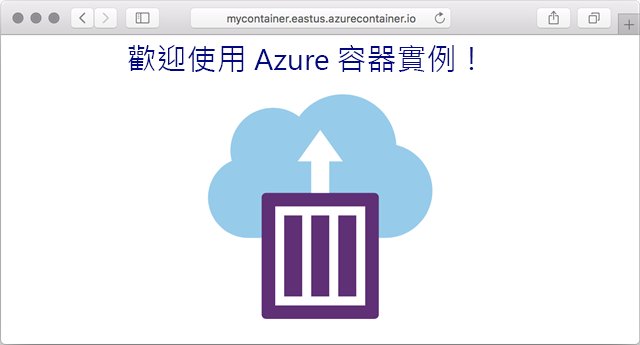

---
wts:
    title: '03 - 部署 Azure 容器執行個體 (10 分鐘)'
    module: '模組 02 - 核心 Azure 服務 (工作負載)'
---

# 03 - 部署 Azure 容器執行個體 (10 分鐘)

在這個逐步解說中，我們將使用 Azure 入口網站中的 Azure 容器執行個體 (ACI) 建立、設定和部署容器。容器是顯示靜態 HTML 頁面的 Welcome to ACI Web 應用程式。 

# 工作 1：建立容器執行個體 

在這個工作中，我們將為 Web 應用程式建立一個新的容器執行個體。 

1. 登入到 [Azure 入口網站](https://portal.azure.com)。

2. 從 [**所有服務**] 刀鋒視窗，搜尋並選取 [**容器執行個體**]，然後按一下 [**+ 新增、+ 建立、+ 新建]**。 

3. 為新容器執行個體提供下列基本詳細資訊 (其他所有內容保留預設值)： 

	| 設定| 值|
	|----|----|
	| 訂用帳戶 | ***使用提供的預設值*** |
	| 資源群組 | **建立新資源群組** |
	| 容器名稱| **mycontainer**|
	| 區域 | **美國東部** |
	| 映像來源| **Docker 中樞或其他登錄**|
	| 映像類型| **公用**|
	| 映像| **mcr.microsoft.com/azuredocs/aci-helloworld**|
	| OS 類型| **Linux** |
	| 大小| ***保留預設值***|

4. 設定 [網路] 索引標籤 (將 **xxxxx** 替換為字母和數位，以便名稱具有全域唯一性)。保留所有其他設定的預設值。

	| 設定| 值|
	|--|--|
	| DNS 名稱標籤| **mycontainerdnsxxxxx** |

	
	**附註**：您的容器可以透過 dns-name-label.region.azurecontainer.io 供公眾存取。如果部署後收到 [**DNS 名稱標籤不可用**] 錯誤訊息，請指定其他 DNS 名稱標籤 (替換 xxxxx) 並重新部署。 

5. 按一下 [**檢閱並建立**] 以啟動自動驗證程序。

6. 按一下 [**建立**] 以建立容器執行個體。 

7. 監視部署頁面和 [**通知**] 頁面。 

# 工作 2：驗證容器執行個體的部署

在這個工作中，我們透過確保顯示歡迎頁面來驗證容器執行個體是否正在執行。

1. 在部署完成後，請按一下部署刀鋒視窗中的 [**前往資源**] 連結或 [通知] 區域中的資源連結。

2. 在 **mycontainer** 的 [**概觀**] 刀鋒視窗中，確保您的容器 [**狀態**] 為 [**正在執行**]。 

3. 找到完整網域名稱 (FQDN)。

	![Azure 入口網站中新建立容器的 [概觀] 窗格的螢幕擷取畫面，其中醒目提示了 FQDN。 ](../images/0202.png)

2. 將容器的 FQDN 複製到新 Web 瀏覽器索引標籤，然後按一下 **Enter** 鍵。[歡迎] 頁面應顯示。 

	

**恭喜！** 您已使用 Azure 入口網站將應用程式成功部署到 Azure 容器執行個體中的容器。

**注意**：為了避免額外的成本，您可以删除此資源群組。搜尋資源群組，按一下您的資源群組，然後按一下 [**删除資源群組**]。驗證資源群組的名稱，然後按一下 [**删除**]。監視 [**通知**] 以驗證删除的狀態。
