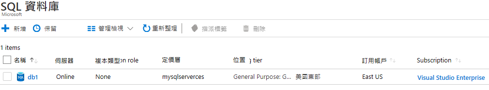
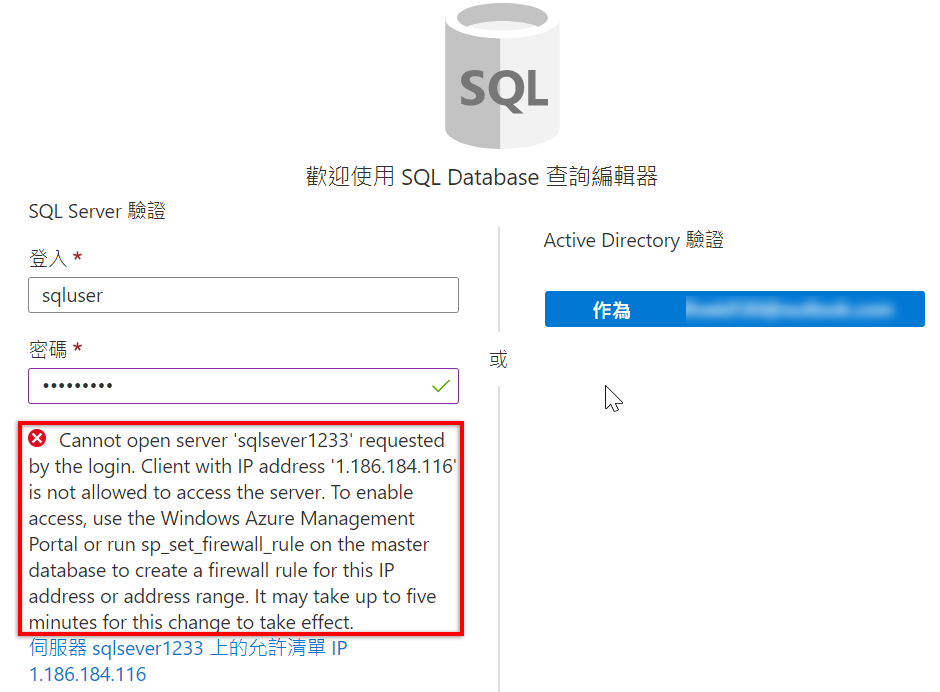
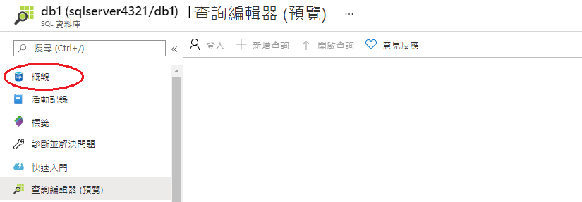
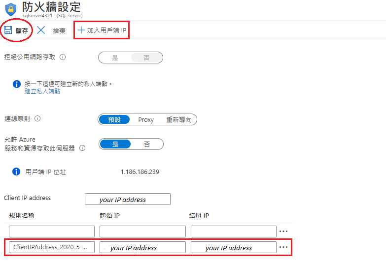
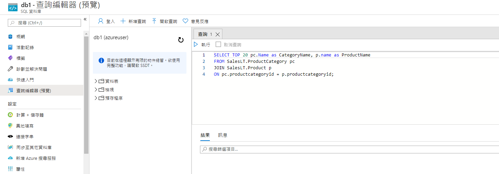

---
wts:
    title: '06 - 建立 SQL Database (5 分鐘)'
    module: '模組 02 - 核心 Azure 服務 (工作負載)'
---

# 06 - 建立 SQL Database (5 分鐘)

在這個逐步解說中，我們將在 Azure 中建立 SQL Database，然後査詢該資料庫中的資料。

# 工作 1：建立資料庫 

在這個工作中，您將根據 AdventureWorksLT 範例資料庫建立 SQL Database。 

1. 登入到 Azure 入口網站，網址：[**https://portal.azure.com**](https://portal.azure.com)。

2. 從 [**所有服務**] 刀鋒視窗，搜尋並選取 [**SQL Database**]，然後按一下 [**+ 新增、+ 建立、+ 新建**]。 

3. 在 [**基本**] 索引標籤中，填寫下列資訊。  

    | 設定 | 值 | 
    | --- | --- |
    | 訂用帳戶 | **使用提供的預設值** |
    | 資源群組 | **建立新資源群組** |
    | 資料庫名稱| **db1** | 
    | 伺服器 | 選取 [**新增**] (右側將打開一個新的側邊欄)|
    | 伺服器名稱 | **sqlserverxxxx** (必須唯一) | 
    | 位置 | **美國東部** |
    | 驗證方法 | **使用 SQL 驗證** |
    | 伺服器管理員登入 | **sqluser** |
    | 密碼 | **Pa$$w0rd1234** |
    | 按一下  | **確定** |

   ![[伺服器] 窗格和 [新增伺服器] 窗格的螢幕擷取畫面，其中按表填寫欄位，並醒目提示 [檢閱+建立] 和 [確定] 按鈕。](../images/0501.png)

4. 在 [**網路**] 索引標籤上，設定下列設定 (保留其他項目為預設值) 

    | 設定 | 值 | 
    | --- | --- |
    | 連線方法 | **公用端點** |    
    | 允許 Azure 服務和資源存取該伺服器 | **是** |
    | 新增當前用戶端 IP 位址 | **否** |
    
   ![[建立 SQL Database] 刀鋒視窗的 [網路] 索引標籤的螢幕擷取畫面，根據表選擇設定，並醒目提示 [檢閱 + 建立] 按鈕。](../images/0501b.png)

5. 在 [**安全性**] 索引標籤上。 

    | 設定 | 值 | 
    | --- | --- |
    | Microsoft Defender for SQL| **現在不需要** |
    
6. 前往 [**其他設定**] 索引標籤。我們將使用 AdventureWorksLT 範例資料庫。

    | 設定 | 值 | 
    | --- | --- |
    | 使用現有資料 | **範例** |

    ![[建立 SQL Database] 刀鋒視窗的 [其他設定] 索引標籤的螢幕擷取畫面，根據表選擇設定，並醒目提示 [檢閱 + 建立] 按鈕。](../images/0501c.png)

7. 按一下 [**檢閱 + 建立**]，然後按一下 [**建立**] 以部署和佈建資源群組和資料庫。大學需要 2 - 5 分鐘才能完成部署。


# 工作 2：測試該資料庫。

在這個工作中，我們將設定 SQL Server 並執行 SQL 査詢。 

1. 部署完成後，請在部署刀鋒視窗中按一下 [前往資源]。也可以從 [**所有資源**] 刀鋒視窗，搜尋並選取 [**資料庫**]，然後選取 [**SQL Database**]，確保您已建立新資料庫。您可能需要 [**重新整理**] 頁面。

    

2. 按一下表示您建立的 SQL Database 的 **db1** 項目。在 [db1] 刀鋒視窗上，按一下 [**査詢編輯器 (預覽)**]。

3. 登入為 **sqluser**，並使用密碼 **Pa$$w0rd1234**。

4. 您將無法登入。仔細閱讀錯誤並記下需要允許通過防火牆的 IP 位址。 

    

5. 返回到 [**db1**] 刀鋒視窗中，按一下 [**概觀**]。 

    

6. 在 db1 的 [**概觀**] 刀鋒視窗中，按一下位於概覽荧幕頂部中間的 [**設定伺服器防火牆**]。

7. 按一下 [**+ 新增用戶端 IP**] (頂部功能表列)，新增錯誤中引用的 IP 位址。(它可能已經為您自動填充 - 如果沒有，請將其粘貼到 IP 位址欄位中)。確保 [**儲存**] 您的變更。 

    

8. 返回到 SQL Database (將底部的切換欄滑到左側)，然後按一下 [**査詢編輯器 (預覽)**]。嘗試再次登入為 **sqluser**，並使用密碼 **Pa$$w0rd1234**。這次您應該會成功。請注意，部署新的防火牆規則可能需要幾分鐘的時間。 

9. 成功登入後，將顯示査詢窗格。在編輯器窗格中輸入以下査詢。 

    ```SQL
    SELECT TOP 20 pc.Name as CategoryName, p.name as ProductName
    FROM SalesLT.ProductCategory pc
    JOIN SalesLT.Product p
    ON pc.productcategoryid = p.productcategoryid;
    ```

    

10. 按一下 [**執行**]，然後在 [**結果**] 窗格中查看查詢結果。査詢應成功執行。

    ![[資料庫査詢編輯器] 窗格的螢幕擷取畫面，其中 SQL 程式碼已成功執行，且輸出顯示在 [結果] 窗格中。](../images/0508.png)

恭喜！您已在 Azure 中建立 SQL Database，然後成功査詢了該資料庫中的資料。

**注意**：為了避免額外的成本，您可以删除此資源群組。搜尋資源群組，按一下您的資源群組，然後按一下 [**删除資源群組**]。驗證資源群組的名稱，然後按一下 [**删除**]。監視 [**通知**] 以驗證删除的狀態。
