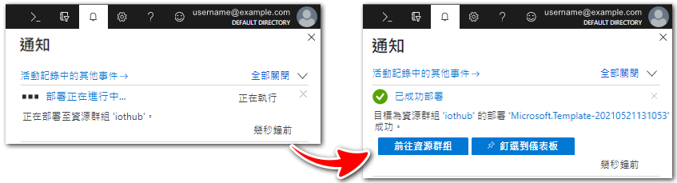
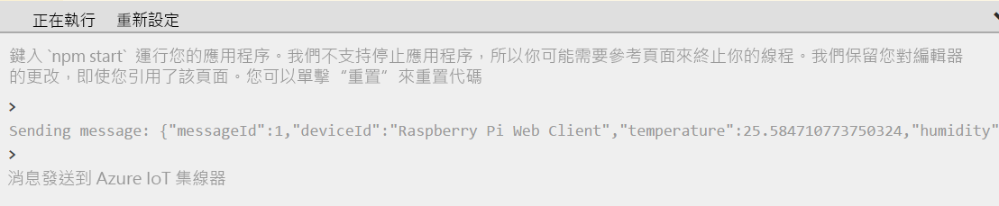
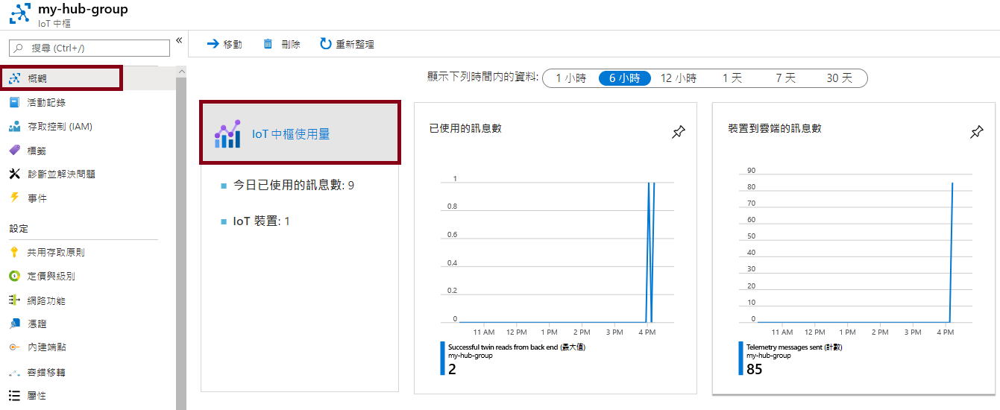

---
wts:
    title: '07 - 實作 Azure IoT 中樞 (10 分鐘)'
    module: '模組 03：描述核心解決方案和管理工具'
---
# 07 - 實作 Azure IoT 中樞 (10 分鐘)

在這個逐步解說中，我們將在 Azure 入口網站中設定一個新的 Azure IoT 中樞，然後使用線上 Raspberry Pi 裝置模擬器驗證到 IoT 裝置的連線。感測器資料和訊息從 Raspberry Pi 模擬器傳遞到 Azure IoT 中樞，然後您可以在 Azure 入口網站中查看訊息傳遞活動的度量。

# 工作 1：建立 IoT 中樞 

在這個工作中，我們將建立一個 IoT 中樞。 

1. 登入到 [Azure 入口網站](https://portal.azure.com)。

2. 從 [**所有服務**] 刀鋒視窗，搜尋並選取 [**IoT 中樞**] 然後按一下 [**+ 新增、+ 建立、+ 新建**]。

3. 在 [**IoT 中樞**] 刀鋒視窗的 [**基本**] 索引標籤上，填充下列詳細資訊 (將儲存體帳戶名稱中的 **xxxx** 替換為字母和數位，以便名稱全域唯一)：

    | 設定 | 值 |
    |--|--|
    | 訂用帳戶 | **保留提供的預設值** |
    | 資源群組 | **建立新資源群組** |
    | 區域 | **美國東部** |
    | IoT 中樞名稱 | **my-hub-groupxxxxx** |

    **注意** - 記得變更 **xxxxx**，將其設定為唯一 **IoT 中樞名稱**。

4. 前往 [**管理**] 索引標籤，並使用下拉式清單將 [**定價和規模層**] 設定為 [**S1：標準層**]。

5. 按一下 [**檢閱 + 建立**] 按鈕。

6. 按一下 [**建立**] 按鈕，開始建立新 Azure IoT 中樞執行個體。

7. 請等待 Azure IoT 中樞執行個體部署完成。 

# 工作 2：新增 IoT 裝置

在這個工作中，我們將想 IoT 中樞中新增一個 IoT 裝置。 

1. 部署完成後，請在部署刀鋒視窗中按一下 [**前往資源**]。或者從 [**所有服務**] 刀鋒視窗中，搜尋並選取 [**IoT 中樞**] 並找到新 IoT 中樞執行個體

	

2. 若需新增 IoT 裝置，請滾動到 [**總管**] 區段，接著按一下 [**IoT 裝置**]。然後按一下 [**+ 新增、+ 建立、+ 新建**]。

	![IoT 裝置窗格的螢幕擷取畫面，在 Azure 入口網站中的的 IoT 中樞導覽刀鋒視窗中醒目提示。醒目提示 [新增] 按鈕，以說明如何向 IoT 中樞新增 IoT 裝置身分識別。](../images/0602.png)

3. 將新 IoT 裝置命名為 **myRaspberryPi**，然後按一下 [**儲存**] 按鈕。這將在 Azure IoT 中樞中建立新的 IoT 裝置身分識別。

4. 如果您沒有看到新裝置，請 [**重新整理**] [IoT 裝置] 頁面。 

5. 選取 **myRaspberryPi** 並複製 [**主要連線字串**] 值。您將在下一個工作中使用此金鑰來驗證到 Raspberry Pi 模擬器的連線。

	![醒目提示複製圖示的 [主要連線字串] 頁面的螢幕擷取畫面。](../images/0603.png)

# 工作 3：使用 Raspberry Pi 模擬器測試裝置

在這個工作中，我們將使用 Raspberry Pi 模擬器測試我們的裝置。 

1. 開啟 Web 瀏覽器中的新索引標籤，並輸入此捷徑連結 https://aka.ms/RaspPi 。它將帶您去一個 Raspberry Pi 模擬器網站。如果您有時間，請閱讀關於 Raspberry Pi 模擬器的文章。完成後，選取**X**關閉快顯視窗。

2. 在程式碼區域的右側，找到含有「const connectionString =」的行。將其替換為從 Azure 入口網站複製的連線字串。注意，連線字串包含 DeviceId (**myRaspberryPi**) 和 SharedAccessKey 項目。

	

3. 按一下 [**執行**] (位於程式碼區域下面)，執行該應用程式。主控台輸出應該顯示從 Raspberry Pi 模擬器傳送到 Azure IoT 中樞的感測器資料和訊息。每次 Raspberry Pi 模擬器 LED 閃爍時都會傳送資料和訊息。 

	

5. 按一下 [**停止**]，停止傳送資料。

6. 返回到 Azure 入口網站。

7. 切換 IoT 中樞的 [**概觀**] 刀鋒視窗，並向下滾動到 [**IoT 中樞使用**] 資訊以檢視使用資訊。變更 [**顯示最後一小時的資料**] 中的時間範圍，以查看最後一小時的資料。

	

恭喜！您已經設定完 Azure IoT 中樞來從 IoT 裝置收集感測器資料。

**注意**：為了避免額外的成本，您可以删除此資源群組。搜尋資源群組，按一下您的資源群組，然後按一下 [**删除資源群組**]。驗證資源群組的名稱，然後按一下 [**删除**]。監視 [**通知**] 以驗證删除的狀態。
