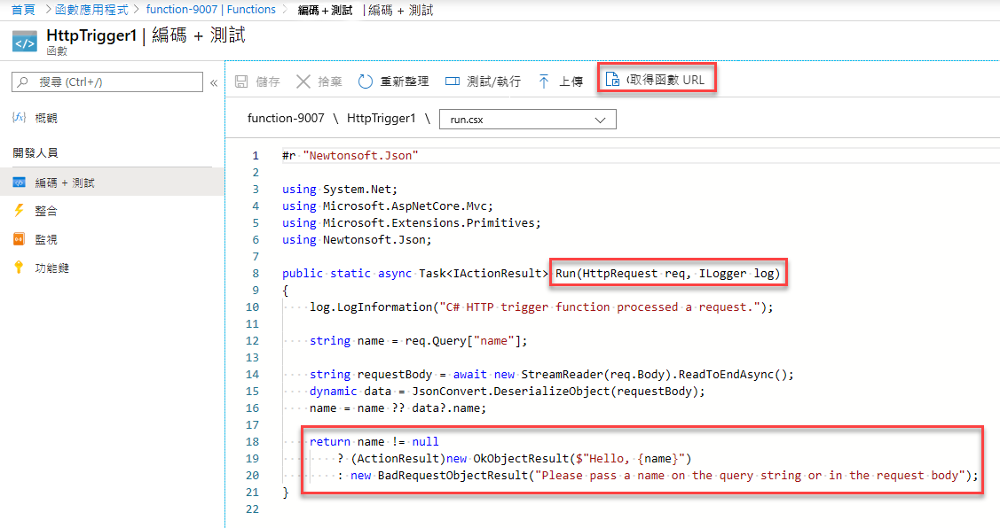
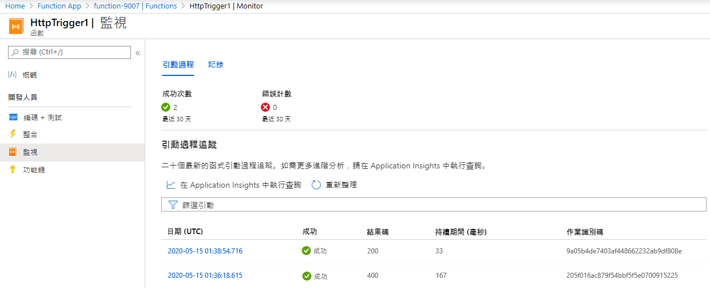

---
wts:
    title: '08 - 實作 Azure Functions (5 分鐘)'
    module: '模組 03：描述核心解決方案和管理工具'
---
# 08 - 實作 Azure Functions

在這個逐步解說中，我們將建立一個函數應用程式，以便在有 HTTP 要求時顯示 Hello 訊息。 

# 工作 1：建立函數應用程式 (5 分鐘)

在這個工作中，我們將建立一個函數應用程式。

1. 登入到 [Azure 入口網站](https://portal.azure.com)。

1. 在入口網站頂部的 [**搜尋資源、服務和文件**] 文字方塊中，搜尋並選取 [**函數應用程式**]，然後從 [**函數應用程式**] 刀鋒視窗，按一下 [**+ 新增、+ 建立 或 + 新建**]。

1. 在 [**函數應用程式**] 刀鋒視窗的 [**基本**] 索引標籤上，指定以下設定 (將函數名稱中的 **xxxx** 替換為字母和數位，以使名稱全域唯一，並保留所有其他設定的預設值)： 

    | 設定 | 值 |
    | -- | --|
    | 訂用帳戶 | 您的 Azure 訂用帳戶的名稱 |
    | 資源群組 | 新資源群組 **myRGFunction** 的名稱 |
    | 函數應用程式名稱 | **function-xxxx** |
    | 發佈 | **程式碼** |
    | 執行階段堆疊 | **NET** |
    | 版本 | **3.1** |
    | 區域 | **美國東部** |
    | | |

    **注意** - 記得變更 **xxxx**，將其設定為唯一**函數應用程式名稱**

1. 按一下 [**檢閱 + 建立**] 並在驗證成功後，按一下 [**建立**] 以開始佈建並部署新 Azure 函數應用程式。

1. 等待資源已成功建立的通知。

1. 導覽回 [**函數應用程式**] 刀鋒視窗，按一下 [**重新整理**] 並驗證新建立的函數應用程式的狀態為 [**正在執行**]。 

    ![[函數應用程式] 頁面的熒幕擷取畫面，其中包含新函數應用程式。](../images/0701.png)

# 工作 2：建立一個 HTTP 觸發的函數並進行測試

在這個工作中，我們將使用 Webhook + API 函數在有 HTTP 要求時顯示訊息。 

1. 在 [**函數應用程式**] 刀鋒視窗上，按一下新增的函數應用程式。 

1. 在 [函數應用程式] 刀鋒視窗的 [**函數**] 區段，按一下 [**函數**]，接著按一下 [**+ 新增**]。

    ![在 Azure 入口網站中的 [Azure functions for .Net 快速入門] 窗格中選擇開發環境步驟的熒幕擷取畫面。用於建立新入口函數的顯示元素將醒目提示。醒目提示的元素包括展開函數應用程式、新增函數、入口以及 [繼續] 按鈕。](../images/0702.png)

1. 在 [**新增函數**] 刀鋒視窗的 [**選取範本**] 區段，按一下 [**HTTP 觸發器**]，在 [**範本詳細資料**] 區段下，接受預設值，然後按一下 [**新增**]。

1. 在 **HttpTrigger1** 刀鋒視窗上的 [**開發人員**] 區段，按一下 [**程式碼 + 測試**]。 

1. 在 **HttpTrigger1 \| [程式碼 + 測試]** 刀鋒視窗上，檢閱自動生成的程式碼，並注意該程式碼是為執行 HTTP 要求和記錄資訊而設計的。另外，請注意，函數返回一個帶有名稱的 Hello 訊息。 

    

1. 從函數編輯器頂部按一下 [**取得函數 URL**]。 

1. 確保 [**金鑰**] 下拉式清單設定為 [**預設值**]，然後按一下 [**複製**] 來複製函數 URL。 

    ![Azure 入口網站中函數編輯器內 [取得函數 URL] 窗格的螢幕擷取畫面。醒目提示元素 [取得函數 URL] 按鈕、[設定金鑰] 下拉清單和 [複製 URL] 按鈕，以說明如何從函數編輯器取得和複製函數 URL。](../images/0705.png)

1. 開啟新的瀏覽器索引標籤，並將複製的函數 URL 貼上到 Web 瀏覽器的網址列中。要求頁面時，函數將執行。請注意返回的訊息，該訊息會指出函數需要要求主體中的名稱。

    

1. 將 **&name=*yourname*** 附加到 URL 的末尾。

    **注意**：使用您的名字替換 ***yourname***。例如，如果您的名字是 Cindy，最後的 URL 將類似於 `https://azfuncxxx.azurewebsites.net/api/HttpTrigger1?code=X9xx9999xXXXXX9x9xxxXX==&name=cindy`

    

1. 當函數執行時，會跟踪每個調用。若要在 Azure 入口網站中檢視跟蹤，請返回到 **HttpTrigger1 \| [程式碼 + 測試]** 刀鋒視窗，並按一下 [**監視**]。

     

恭喜！您已經建立了一個函數應用程式，以便在有 HTTP 要求時顯示 Hello 訊息。 

**注意**：為了避免額外的成本，您可以删除此資源群組。搜尋資源群組，按一下您的資源群組，然後按一下 [**删除資源群組**]。驗證資源群組的名稱，然後按一下 [**删除**]。監視 [**通知**] 以驗證删除的狀態。
