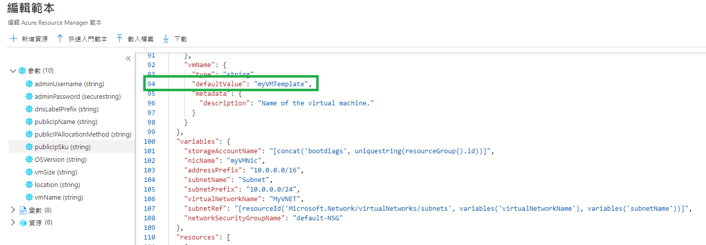
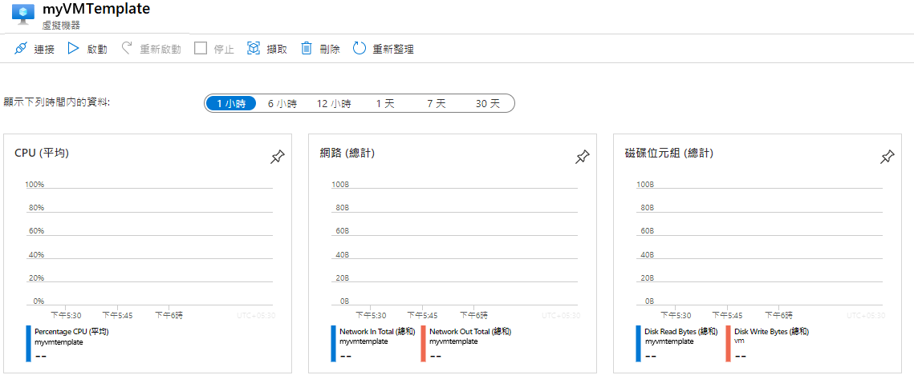

---
wts:
    title: '09 - 使用範本建立 VM (10 分鐘)'
    module: '模組 03：描述核心解決方案和管理工具'
---
# 09 - 使用範本建立 VM (10 分鐘)

在這個逐步解說中，我們將部署一個帶有快速入門範本的虛擬機器，並檢查監視功能。

# 工作 1：探索快速入門圖庫並定位範本 

在這個工作中，我們將使用 Azure 快速入門圖庫部署建立虛擬機器的範本。 

1. 在實驗室環境中，開啟一個新的瀏覽器視窗，然後輸入 https://azure.microsoft.com/zh-tw/resources/templates/?azure-portal=true 。在該圖庫中，您會找到一些流行的和最近更新的範本。這些範本自動部署 Azure 資源，包括安裝流行的軟體套件。瀏覽許多不同類型的可用範本。

3. 選取 [**部署一個簡單的 Windows VM**]。

4. 按一下 [**部署到 Azure**] 按鈕。您的瀏覽器工作階段將自動重定向到 [Azure 入口網站](http://portal.azure.com/)。

    **注意**：[**部署到 Azure**] 按鈕使您能够透過 Azure 入口網站部署範本。在這種部署過程中，只會提示您輸入一小部分設定參數。 

5. 出現提示時，登入您的 Azure 訂用帳戶。

6. 在 [**自訂部署**] 刀鋒視窗上，按一下 [**編輯範本**]。資料管理員範本格式使用 JSON 格式。檢閱參數和變數。  然後找到虛擬機器名稱的參數。將名稱更改為 **myVMTemplate**。**儲存**您的變更。您將返回到 Azure 入口網站中的 [**自訂部署**] 刀鋒視窗。

    

7. 在 [**自訂部署**] 刀鋒視窗上，設定範本所需的參數 (將 DNS 標籤首碼中的 ***xxxx*** 替換為字母和數位，以便標籤具有全域唯一性)。其他內容都保留預設值。 

    | 設定| 值|
    |----|----|
    | 訂用帳戶 | **保留提供的預設值**|
    | 資源群組 | **建立新資源群組** |
    | 區域 | 保留預設值 |
    | 管理員使用者名稱 | **azureuser** |
    | 管理員密碼 | **Pa$$w0rd1234** |
    | DNS 標籤首碼 | **myvmtemplatexxxx** |
    | OS 版本 | **2019-Datacenter** |

9. 按一下 [**檢閱 + 建立**]。

10. 監視您的部署。 

# 工作 2：驗證並監視您的虛擬機器部署

在這個工作中，我們將驗證虛擬機器部署是否正確。 

1. 從 [**所有服務**] 刀鋒視窗，搜尋並選取 [**虛擬機器**]。

2. 確保建立新的虛擬機器。 

    

3. 選取您的虛擬機器，然後在 [**概觀**] 窗格上選取 [**監視**] 索引標籤，向下滾動以檢視監視資料。

    **注意**：監視時間範圍可從 1 小時調整為 30 天。

4. 檢閱提供的不同圖表，包含 [**CPU (平均)**]、[**網路 (總計)**] 和 [**磁碟位元組 (總計)**]。 

    

5. 按一下任意圖表。注意，您可以**新增計量**，並更改圖表類型。

6. 返回到 [**概觀**] 刀鋒視窗。(向左滑動切換列)
7. 按一下 [**活動記錄**] (左側窗格)。活動記錄會記錄資源的建立或修改等事件。 

8. 按一下 [**新增篩選器**]，並嘗試搜尋不同的事件類型和操作。 

    ![已選取事件類型的 [新增篩選器] 頁面的螢幕擷取畫面。](../images/0904.png)

恭喜！您已成功地從範本建立了資源，並將該範本部署到 Azure。

**注意**：為了避免額外的成本，您可以删除此資源群組。搜尋資源群組，按一下您的資源群組，然後按一下 [**删除資源群組**]。驗證資源群組的名稱，然後按一下 [**删除**]。監視 [**通知**] 以驗證删除的狀態。
