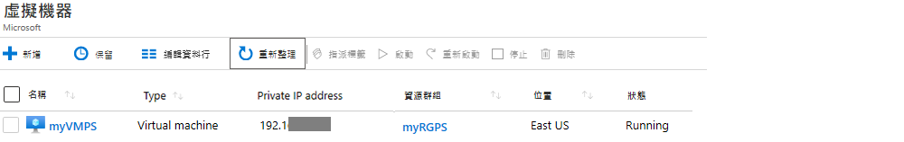

---
wts:
    title: '10 - 使用 PowerShell 建立 VM (10 分鐘)'
    module: '模組 03：描述核心解決方案和管理工具'
---
# 10 - 使用 PowerShell 建立 VM (10 分鐘)

在這個逐步解說中，我們將設定 Cloud Shell，使用 Azure PowerShell 模組建立資源群組和虛擬機器，並檢閱 Azure Advisor 建議。 

# 工作 1：設定 Cloud Shell 

在這個工作中，我們將設定 Cloud Shell。 

1. 登入到 [Azure 入口網站](https://portal.azure.com)。

2. 從 Azure 入口網站中，按一下 Azure 入口網站右上角的圖示，開啟 **Azure Cloud Shell**。

    

3. 當系統提示您選取 **Bash** 或 **PowerShell** 時，選取 **PowerShell**。

4. 在 [**您沒有掛接儲存體**] 荧幕上，選取 [**顯示進階設定**]，然後填充下面的資訊

    | 設定 | 值 |
    |  -- | -- |
    | 資源群組 | **建立新資源群組** |
    | 儲存體帳戶 (建立新帳戶並使用全域唯一名稱 (例如：cloudshellstoragemystorage)) | **cloudshellxxxxxxx** |
    | 檔案共用 (新增) | **shellstorage** |

5. 選取 [**建立儲存體**]

# 工作 2：建立資源群組和虛擬機器

在這個工作中，我們將使用 PowerShell 建立一個資源群組和一個虛擬機器。  

1. 確保在 Cloud Shell 窗格的左上角下拉式功能表中選取了 **PowerShell**。

2. 透過在 Powershell 視窗中執行以下命令來驗證您的新資源群組。按一下 **Enter** 以執行命令。

    ```PowerShell
    Get-AzResourceGroup | Format-Table
    ```

3. 透過將下列命令貼上到終端視窗中來建立虛擬機器。 

    ```PowerShell
    New-AzVm `
    -ResourceGroupName "myRGPS" `
    -Name "myVMPS" `
    -Location "East US" `
    -VirtualNetworkName "myVnetPS" `
    -SubnetName "mySubnetPS" `
    -SecurityGroupName "myNSGPS" `
    -PublicIpAddressName "myPublicIpPS"
    ```
    
4. 出現提示時，請提供使用者名稱 (**azureuser**) 和密碼 (**Pa$$w0rd1234**)，它們將設定為該虛擬機器 azureadmin 上的本地管理員帳戶。

5. 建立 VM 後，關閉 PowerShell 工作階段 Cloud Shell 窗格。

6. 在 Azure 入口網站中，搜尋 [**虛擬機器**]，並驗證 **myVMPS** 正在執行。這可能會需要幾分鐘。

    

7. 存取新的虛擬機器並檢閱 [概觀和網路] 設定，以驗證資訊是否正確部署。 

# 工作 3：在 Cloud Shell 中執行命令

在這個工作中，我們將練習從 Cloud Shell 執行 PowerShell 命令。 

1. 從 Azure 入口網站中，按一下 Azure 入口網站右上角的圖示，開啟 **Azure Cloud Shell**。

2. 確保在 Cloud Shell 窗格的左上角下拉式功能表中選取了 **PowerShell**。

3. 擷取有關虛擬機器的資訊，包括名稱、資源群組、位置和狀態。注意，PowerState 為 [**正在執行**]。

    ```PowerShell
    Get-AzVM -name myVMPS -status | Format-Table -autosize
    ```

4. 使用下列命令停止虛擬機器。 

    ```PowerShell
    Stop-AzVM -ResourceGroupName myRGPS -Name myVMPS
    ```
5. 出現提示時，確認 (是) 動作。等待**成功**狀態。

6. 驗證您的虛擬機器狀態。PowerState 現在應該是 [**已解除配置**]。您還可以驗證入口網站中的虛擬機器狀態。關閉 Cloudshell。

    ```PowerShell
    Get-AzVM -name myVMPS -status | Format-Table -autosize
    ```

# 工作 4：檢閱 Azure Advisor 建議

**注意：** 同樣的工作也可以在「使用 Azure CLI 建立 VM」實驗室中完成。 

在這個工作中，我們將檢閱針對虛擬機器的 Azure Advisor 建議。 

1. 從 [**所有服務**] 刀鋒視窗，搜尋並選取 [**Advisor**]。 

2. 在 [**Advisor**] 刀鋒視窗，選取 [**概觀**]。注意，建議按高可用性、安全性、效能和成本分組。 

    ![Advisor 的 [概觀] 頁面的螢幕擷取畫面。 ](../images/1003.png)

3. 選取 [**所有建議**]，並花點時間檢視每個建議和建議的動作。 

    **注意：** 根據您使用的資源，您的建議會有所不同。 

    ![Advisor 的 [所有建議] 頁面的螢幕擷取畫面。 ](../images/1004.png)

4. 請注意，您可以將建議下載為 CSV 或 PDF 檔案。 

5. 請注意，您可以建立警示。 

6. 如果您有時間，請繼續嘗試 Azure PowerShell。 

恭喜！您已經設定了 Cloud Shell，使用 PowerShell 建立了虛擬機器，使用 PowerShell 命令進行了練習，並檢視了 Advisor 建議。

**注意**：為了避免額外的成本，您可以删除此資源群組。搜尋資源群組，按一下您的資源群組，然後按一下 [**删除資源群組**]。驗證資源群組的名稱，然後按一下 [**删除**]。監視 [**通知**] 以驗證删除的狀態。
