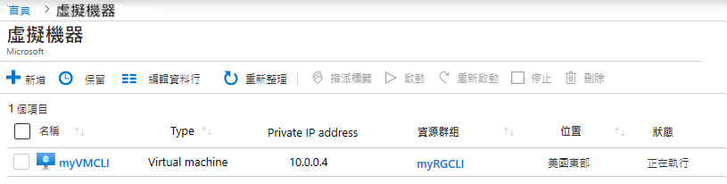

---
wts:
    title: '11 - 使用 CLI 建立 VM (10 分鐘)'
    module: '模組 03：描述核心解決方案和管理工具'
---
# 11 - 使用 CLI 建立 VM (10 分鐘)

在這個逐步解說中，我們將設定 Cloud Shell，使用 Azure CLI 建立資源群組和虛擬機器，並檢閱 Azure Advisor 建議。 

# 工作 1：設定 Cloud Shell 

在這個工作中，我們將設定 Cloud Shell，並使用 Azure CLI 建立一個資源群組和一個虛擬機器。  

1. 登入到 [Azure 入口網站](https://portal.azure.com)。

2. 從 Azure 入口網站中，按一下 Azure 入口網站右上角的圖示，開啟 **Azure Cloud Shell**。

    
   
3. 在 [歡迎使用 Azure Cloud Shell] 對話方塊中，在出現提示時，選取 **Bash** 或 **PowerShell**，然後選取 **Bash**。 

4. 將開啟一個新視窗，顯示 [**您沒有掛接儲存體**]。選取 [**進階設定**]。

5. 在 [進階設定] 荧幕中，填寫以下欄位，然後按一下 [建立儲存體]：
    - 資源群組：**建立新資源群組**
    - 儲存體帳戶：建立新帳戶並使用全域唯一名稱 (例如：cloudshellstoragemystorage)
    - 檔案共用：建立一個新共用，並將其命名為 cloudshellfileshare


# 工作 2：使用 CLI 建立一個虛擬機器

在這個工作中，我們將使用 Azure CLI 建立一個資源群組和一個虛擬機器。

1. 確保在 Cloud Shell 窗格的左上角下拉式功能表中選取 **Bash** (如果沒有，請選取)。

    

2. 在 Cloud Shell 窗格的 Bash 工作階段中，建立新資源群組。 

    ```cli
    az group create --name myRGCLI --location EastUS
    ```

3. 驗證資源群組是否已建立。

    ```cli
    az group list --output table
    ```

4. 在 Cloud Shell 中，輸入下列命令，並確保除最後一行之外的每一行後面都有反斜線 (\) 字元。如果在同一行鍵入整個命令，請不要使用任何反斜線字元。 

    ```cli
    az vm create \
    --name myVMCLI \
    --resource-group myRGCLI \
    --image UbuntuLTS \
    --location EastUS2 \
    --admin-username azureuser \
    --admin-password Pa$$w0rd1234
    ```

    >**注意**：如果在 Windows 電腦上使用命令列，請將反斜線 (`\`) 字元替換為插入符號 (`^`)。

    **注意**：該命令需要 2 到 3 分鐘才能完成。該命令將建立虛擬機器和與其關聯的各種資源，例如儲存體、網路和安性全資源。在虛擬機器部署完成之前，不要繼續執行下一步。 

5. 命令執行完成後，請在流覽器視窗中關閉 Cloud Shell 窗格。

6. 在 Azure 入口網站中，搜尋 [**虛擬機器**]，並驗證 **myVMCLI** 正在執行。

    


# 工作 3：在 Cloud Shell 中執行命令

在這個工作中，我們將練習從 Cloud Shell 執行 CLI 命令。 

1. 從 Azure 入口網站中，按一下 Azure 入口網站右上角的圖示，開啟 **Azure Cloud Shell**。

2. 確保在 Cloud Shell 窗格的左上角下拉式功能表中選取 **Bash**。

3. 擷取有關佈建的虛擬機器的資訊，包括名稱、資源群組、位置和狀態。注意，PowerState 為 [**正在執行**]。

    ```cli
    az vm show --resource-group myRGCLI --name myVMCLI --show-details --output table 
    ```

4. 停止虛擬機器。請注意這樣一條訊息：計費將繼續，直到虛擬機器被釋放。 

    ```cli
    az vm stop --resource-group myRGCLI --name myVMCLI
    ```

5. 驗證您的虛擬機器狀態。PowerState 現在應該是 [**已停止**]。

    ```cli
    az vm show --resource-group myRGCLI --name myVMCLI --show-details --output table 
    ```

# 工作 4：檢閱 Azure Advisor 建議

在這個工作中，我們將檢閱 Azure Advisor 建議。

   **注意：** 如果您已經完成了上一個實驗室 (使用 PowerShell 建立 VM)，那麼您已經執行了此工作。 

1. 從 [**所有服務**] 刀鋒視窗，搜尋並選取 [**Advisor**]。 

2. 在 [**Advisor**] 刀鋒視窗，選取 [**概觀**]。注意，建議按高可用性、安全性、效能和成本分組。 

    ![Advisor 的 [概觀] 頁面的螢幕擷取畫面。 ](../images/1103.png)

3. 選取 [**所有建議**]，並花點時間檢視每個建議和建議的動作。 

    **注意：** 根據您使用的資源，您的建議會有所不同。 

    ![Advisor 的 [所有建議] 頁面的螢幕擷取畫面。 ](../images/1104.png)

4. 請注意，您可以將建議下載為 CSV 或 PDF 檔案。 

5. 請注意，您可以建立警示。 

6. 如果您有時間，請繼續嘗試 Azure CLI。 

恭喜！您已經設定了 Cloud Shell，使用 Azure CLI 建立了虛擬機器，使用 Azure CLI 命令進行了練習，並檢視了 Advisor 建議。

**注意**：為了避免額外的成本，您可以删除此資源群組。搜尋資源群組，按一下您的資源群組，然後按一下 [**删除資源群組**]。驗證資源群組的名稱，然後按一下 [**删除**]。監視 [**通知**] 以驗證删除的狀態。
