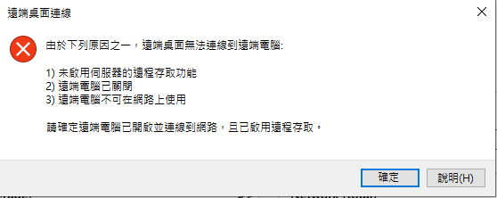

---
wts:
    title: '13 - 保護網路流量 (10 分鐘)'
    module: '模組 04：描述一般安全性和網路安全性功能'
---
# 13 - 保護網路流量

在這個逐步解說中，我們將設定一個網路安全性群組。

# 工作 1：建立虛擬機器 (10 分鐘)

在這個工作中，我們將建立一個 Windows Server 2019 資料中心虛擬機器。 

1. 登入到 [Azure 入口網站](https://portal.azure.com)。

2. 從 [**所有服務**] 刀鋒視窗，搜尋並選取 [**虛擬機器**]，然後按一下 [**+ 新增**]。

3. 在 [**基本**] 索引標籤中，填充下列資訊 (其他內容保留預設值)：

    | 設定 | 值 |
    |  -- | -- |
    | 訂用帳戶 | **選取您的訂用帳戶**|
    | 資源群組 | **myRGSecure** (新增) |
    | 虛擬機器名稱 | **SimpleWinVM** |
    | 位置 | **美國東部**|
    | 映像 | **Windows Server 2019 資料中心**|
    | 大小 | **標準 D2s v3**|
    | 管理員帳戶使用者名稱 | **azureuser** |
    | 管理員帳戶密碼 | **Pa$$w0rd1234**|
    | 輸入連接埠規則 | **無**|
    | | |

4. 切換到 [**網路**] 索引標籤，並設定下列設定：

    | 設定 | 值 |
    | -- | -- |
    | NIC 網路安全性群組 | **無**|
    | | |

5. 切換到 [**管理**] 索引標籤，並在其 [**監視**] 區段中選取以下設定：

    | 設定 | 值 |
    | -- | -- |
    | 啟動診斷 | **停用**|
    | | |

6. 保留其餘的預設值，然後按一下頁面底部的 [**檢閱 + 建立**] 按鈕。

7. 驗證通過後，按一下 [**建立**] 按鈕。部署虛擬機器可能需要 5 分鐘的時間。

8. 監視部署。建立資源群組和虛擬機器可能需要幾分鐘的時間。 

9. 從 [部署] 刀鋒視窗或 [通知] 區域，按一下 [**前往資源**]。 

10. 在 **SimpleWinVM** 虛擬機器刀鋒視窗中，按一下 [**網路**]，檢閱 [**輸入連接埠規則**] 索引標籤，並注意沒有與虛擬機器的網路介面或網路介面所連結的子網路關聯的網路安全性群組。

    **注意**：識別網路介面的名稱。您將在下一個工作中需要它。

# 工作 2：建立網路安全性群組

在這個工作中，我們將建立一個網路安全性群組並將其與網路介面相關聯。

1. 從 [**所有服務**] 刀鋒視窗，搜尋並選取 [**網路安全性群組**]，然後按一下 [**+ 新增**]

2. 在 [**建立網路安全性群組**] 刀鋒視窗的 [**基本**] 索引標籤上，指定下列設定。

    | 設定 | 值 |
    | -- | -- |
    | 訂用帳戶 | **選擇您的訂用帳戶** |
    | 資源群組 | **myRGSecure** |
    | 名稱 | **myNSGSecure** |
    | 區域 | **美國東部**  |
    | | |

3. 按一下 [**檢閱 + 建立**]，然後在驗證後按一下 [**建立**]。

4. 在建立 NSG 後，按一下 [**前往資源**]。

5. 在 [**設定**] 下，按一下 [**網路介口**]，接著按一下 [**+ 關聯**]。

6. 選取在上一個工作中識別的網路互動。 

# 工作 3：設定輸入安全性連接埠規則以允許 RDP

在這個工作中，我們將透過設定輸入安全性連接埠規則來允許虛擬機器的 RDP 流量。 

1. 在 Azure 入口網站中，導覽回 **SimpleWinVM** 虛擬機器的刀鋒視窗。 

2. 在 [**概觀**] 窗格中，按一下 [**連線**]。

3. 嘗試使用 RDP 連線到虛擬機器。依預設，網路安全性群組不允許 RDP。關閉錯誤視窗。 

    

4. 在虛擬機器刀鋒視窗上，向下滾動到 [**設定**] 部分，按一下 [**網路**]，注意 **myNSGSecure (連結到網路介面：myVMNic)** 網路安全性群組的輸入規則會拒絕所有輸入流量，虛擬網路和負載平衡器探測中的流量除外。

5. 在 [**輸入連接埠規則**] 索引標籤，按一下 [**新增輸入連接埠規則**]。完成後，按一下 [**新增**]。 

    | 設定 | 值 |
    | -- | -- |
    | 源 | **任意**|
    | 來源連接埠範圍 | **\*** |
    | 目的地 | **任意** |
    | 目的地連接埠範圍 | **3389** |
    | 協定 | **TCP** |
    | 動作 | **允許** |
    | 優先順序 | **300** |
    | 名稱 | **AllowRDP** |
    | | |

6. 等待要佈建的規則，然後重試將 RDP 新增到虛擬機器中。這次您應該會成功。記住，使用者是 **azureuser**，密碼是 **Pa$$w0rd1234**。

# 工作 4：設定輸出安全性連接埠規則以拒絕網際網路存取

在這個工作中，我們將建立一個 NSG 輸出連接埠規則，該規則將拒絕網際網路存取，然後進行測試以確保該規則正常工作。

1. 在虛擬機器 RDP 工作階段中繼續。 

2. 機器啟動後，開啟 **Internet Explorer** 瀏覽器。 

3. 驗證您可以存取 **https://www.bing.com**，然後關閉 Internet Explorer。您需要透過 IE 增强安全性快顯視窗工作。 

    **注意**：我們現在將設定一個規則來拒絕輸出網際網路存取。 

4. 在 Azure 入口網站中，導覽迴 **SimpleWinVM** 虛擬機器的刀鋒視窗。 

5. 在 [**設定**] 下，按一下 [**網路**]，接著按一下 [**輸出連接埠規則**]。

6. 注意有一條規則 **AllowInternetOutbound**。這是預設規則，不能被刪除。 

7. 按一下 **myNSGSecure (連結到網路介面：myVMNic)** 右側的 [**新增輸出連接埠規則**] 網路安全群組，並設定一個新的具有更高優先順序的輸出安全性規則，該規則將拒絕網際網路通訊。完成後，按一下 [**新增**]。 

    | 設定 | 值 |
    | -- | -- |
    | 源 | **任意**|
    | 來源連接埠範圍 | **\*** |
    | 目的地 | **服務標籤** |
    | 目的地服務標籤 | **網際網路** |
    | 目的地連接埠範圍 | **\*** |
    | 協定 | **TCP** |
    | 動作 | **拒絕** |
    | 優先順序 | **4000** |
    | 名稱 | **DenyInternet** |
    | | |

8. 返回到您的 RDP 工作階段。 

9. 瀏覽到 **https://www.microsoft.com**。該頁面不應顯示。您可能需要透過額外的 IE 增强安全性快顯視窗工作。  

**注意**：為了避免額外的成本，您可以删除此資源群組。搜尋資源群組，按一下您的資源群組，然後按一下 [**删除資源群組**]。驗證資源群組的名稱，然後按一下 [**删除**]。監視 [**通知**] 以驗證删除的狀態。
