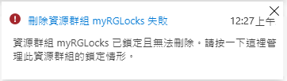
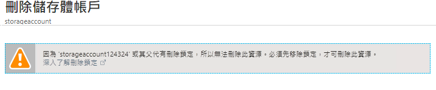

---
wts:
    title: '15 - 管理資源鎖 (5 分鐘)'
    module: '模組 05：描述身分識別、控管、隱私權和合規性功能'
---
# 15 - 管理資源鎖

在這個逐步解說中，我們將向資源群組新增鎖並測試删除資源群組。可以在對資源群組或單個資源的訂用帳戶中套用鎖，以防止意外删除或修改關鍵資源。  

# 工作 1：建立資源群組 (5 分鐘)

在這個工作中，我們將為此練習建立一個資源群組。 

1. 登入到 [Azure 入口網站](https://portal.azure.com)。

2. 在入口網站頂部的 [**搜尋**] 列中，搜尋 [**資源群組**]。 

3. 然後按一下 [**+新增 +新建 +建立**]。 

    | 設定 | 值 |
    | -- | -- |
    | 訂用帳戶 | **使用您的訂用帳戶** |
    | 名稱 | **myRGLocks** |
    | 區域 | **美國東部** |
    

# 工作 2：  向資源群組新增鎖並測試删除

在這個工作中，我們將向資源群組新增資源鎖並測試删除資源群組。 

1. 在 Azure 入口網站中，導覽到新建立的資源群組 **myRGLocks**。

2. 您可以將鎖套用到訂用帳戶、資源群組或單個資源，以防止意外删除或修改關鍵資源。 

3. 在 [**設定**] 區段，按一下 [**鎖**]，然後按一下 [**+ 新增**]。 

    ![顯示 [鎖] 窗格的 myRGLocks 資源群組的螢幕擷取畫面。](../images/1601.png)

4. 設定新鎖。完成後按一下 [**確定**]。 

    | 設定 | 值 |
    | -- | -- |
    | 鎖名稱 | **RGLock** |
    | 鎖類型 | **刪除** |
    | | |

5. 按一下 [**概觀**]，然後按一下 [**刪除資源群組**]。鍵入資源群組的名稱，然後按一下 [**確定**]。您將收到一條錯誤消息，說明資源群組已鎖定，無法删除。

    

# 工作 3：測試删除資源群組的成員

在這個工作中，我們將測試資源鎖是否保護資源群組中的儲存體帳戶。 

1. 從 [**所有服務**] 刀鋒視窗，搜尋並選取 [**儲存體帳戶**]，然後按一下 [**+ 新增、+ 建立或 + 新建**]。 

2. 在 [**儲存體帳戶**] 頁面的 [**+新增 +新建 +建立**] 索引標籤上，填充下列資訊 (將儲存體帳戶名稱中的 **xxxx** 替換為字母和數位，以便名稱全域唯一)。其他內容都保留預設值。

    | 設定 | 值 | 
    | --- | --- |
    | 訂用帳戶 | **選取您的訂用帳戶** |
    | 資源群組 | **myRGLocks** |
    | 儲存體帳戶名稱 | **storageaccountxxxx** |
    | 位置 | **美國東部**  |
    | 效能 | **標準** |
    | 帳戶類型 | **StorageV2 (一般用途 v2)** |
    | 複製 | **內部部署備援儲存體 (LRS)：** |
    | 存取層 (預設) | **經常性** |
   

3. 按一下 [**檢閱 + 建立**]，檢閱儲存體帳戶設定並允許 Azure 驗證設定。 

4. 驗證完成後，請按一下 [**建立**]。等待帳戶已成功建立的通知。 

5.  等待儲存體帳戶已成功建立的通知。 

6. 存取您的新儲存體帳戶，並從 [**概觀**] 窗格，按一下 [**刪除**]。您將收到一條錯誤訊息，說明資源或其父資源具有删除鎖。 

    

    **注意**：雖然我們沒有專門為儲存體帳戶建立鎖，但是我們確實在資源群組級別建立了一個鎖，其中包含儲存體帳戶。因此，這個*父*級鎖阻止我們删除資源，且儲存體帳戶從父級繼承鎖。

# 工作 4：刪除資源鎖

在這個工作中，我們將刪除資源鎖並進行測試。 

1. 返回到 **myRGLocks-XXXXXXXX** 資源群組刀鋒視窗，在 [**設定**] 區段，按一下 [**鎖**]。
    
2. 按一下 [**編輯**] 右側的 **myRGLocks-XXXXXXXX** 項目最右側的 [**刪除**] 連結。

    ![醒目提示 [删除] 連結的鎖的螢幕擷取畫面。](../images/1604.png)

3. 返回到儲存體帳戶刀鋒視窗並確認現在可以删除資源。

恭喜！您建立了資源群組，向資源群組新增了鎖並測試了删除，測試了删除資源群組中的資源，然後删除了資源鎖。 

**注意**：為了避免額外的成本，您可以删除此資源群組。搜尋資源群組，按一下您的資源群組，然後按一下 [**删除資源群組**]。驗證資源群組的名稱，然後按一下 [**删除**]。監視 [**通知**] 以驗證删除的狀態。
