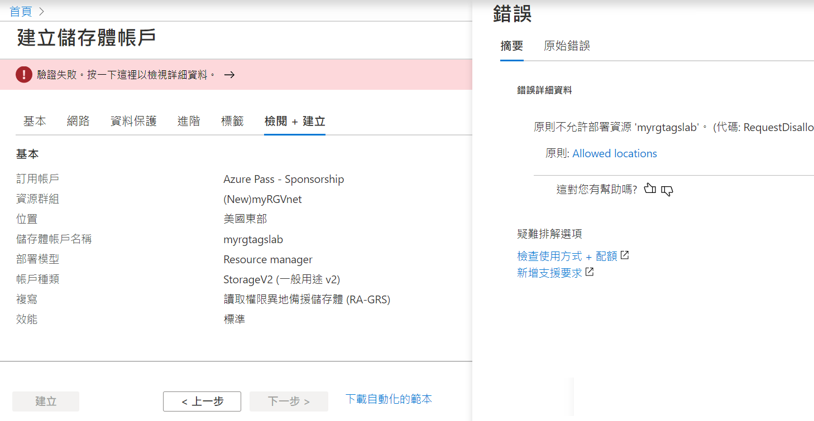
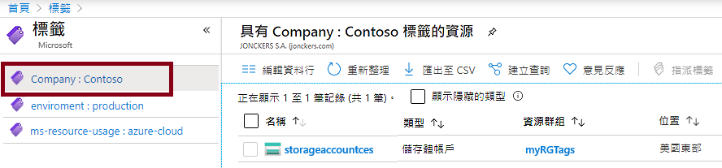
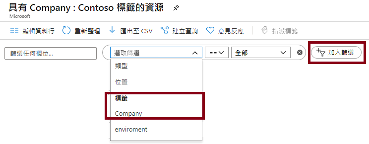

---
wts:
    title: '16 – 實作資源標記 (5 分鐘)'
    module: '模組 05：描述身分識別、控管、隱私權和合規性功能'
---
# 16 – 實作資源標記 (5 分鐘)

在這個逐步解說中，我們將建立需要標記的原則指派，建立儲存體帳戶並測試標記，檢視具有指定標記的資源，然後删除標記原則。

# 工作 1：建立原則指派 

在這個工作紅，我們將 [**需要資源上的標記**] 原則並將其指派給我們的訂用帳戶。 

1. 登入到 [Azure 入口網站](https://portal.azure.com)。

2. 從 [**所有服務**] 刀鋒視窗，搜尋並選取 [**原則**]。

3. 向下滾動到 [**製作**] 區段，按一下 [**指派**]，然後按一下頁面頂部的 [**指派原則**]

4. 請注意，我們的原則 [**範圍**] 將是訂用帳戶範圍。 

5. 在 [**基本**] 下，選取 [**原則定義**] 省略號按鈕 (文字方塊的右側)。在 [**搜尋**] 方塊中，輸入值 **tag**。包含字詞 **tag** 的相關原則清單將會顯示。向下滾動到 [**需要資源上的標記**] 定義，按一下 [**選取**]。

   ![[可用定義] 窗格的螢幕擷取畫面，其中選取了 [需要資源上的標記]。](../images/1701.png)
   
6. 在 [**參數**] 索引標籤上，鍵入 **Company** 標記名稱。為值鍵入 **Contoso**。按一下 [**檢閱 + 建立**]，然後按一下 [**建立**]。

    ![填寫了標記名稱的 [指派原則] 窗格的螢幕擷取畫面。](../images/1702.png)

7. [**需要資源上的標記**] 原則指派現已到位。建立資源時，必須包含帶有 Company 金鑰的標記。
   **注意 - 您需要等待 30 分鐘才能完成套用原則。** 

   ![[原則 - 分配] 窗格的螢幕擷取畫面，醒目提示允許的位置指派。](../images/1703.png)

# 工作 2：建立儲存體帳戶以測試所需的標記

在這個工作中，我們將建立儲存體帳戶以測試所需的標記。 

1. 在 Azure 入口網站的 [**所有服務**] 刀鋒視窗，搜尋並選取 [**儲存體帳戶**]，然後按一下 [**+ 新增、+ 建立、+ 新建**]。

2. 在 [**建立儲存體帳戶**] 刀鋒視窗的 [**基本**] 索引標籤上，填充下列資訊 (將儲存體帳戶名稱中的 **xxxx** 替換為字母和數位，以便名稱全域唯一)。其他內容都保留預設值。

    | 設定 | 值 | 
    | --- | --- |
    | 訂用帳戶 | **使用提供的預設值** |
    | 資源群組 | **建立新資源群組** |
    | 儲存體帳戶名稱 | **storageaccountxxxx** |
    | 位置 | **美國東部** |

3. 按一下 [**檢閱 + 建立**]。 

    **注意：**我們正在測試，看看當標記沒有提供時會發生什麼。請注意，原則可能需要長達 30 分鐘才會生效。

4. 您將收到驗證失敗訊息。按一下 [**按一下此處查看詳細資訊**] 訊息。在 [**錯誤**] 刀鋒視窗的 [**摘要**] 索引標籤上，請注意說明了原則不允許使用資源的錯誤訊息。

    **注意：** 如果您檢視 [原始錯誤] 索引標籤，您將看到所需的特定標記名稱。 

    

5. 關閉 [**錯誤**] 窗格，並按一下 [**上一步**] (熒幕底部)。提供標記資訊。 

    | 設定 | 值 | 
    | --- | --- |
    | 標記名稱 | **Company** (可能不在下拉式清單中) |
    | 標記值 | **Contoso** |

6. 按一下 [**檢閱 + 建立**]，然後檢查驗證是否成功。按一下 [**建立**] 以部署儲存體帳戶。 

# 工作 3：檢視使用特定標記的所有資源

1. 在 Azure 入口網站的 [**所有服務**] 刀鋒視窗，搜尋並選取 [**原則**]。

2. 注意所有標記及其值。按一下 [**Company：Contoso**] 金鑰/值對。這將顯示一個刀鋒視窗，顯示新建立的儲存體帳戶，只要您在部署期間包含了標記。 

   

3. 在入口網站中，顯示 [**所有資源**] 刀鋒視窗。

4. 按一下 [**新增篩選器**]，並新增 **Company** 標記金躍作為篩選器類別。套用篩選器後，將只列出您的儲存體帳戶。

    

# 工作 4：刪除原則指派

在這個工作中，我們將刪除 [**需要資源上的標記**] 原則，這樣它就不會影響我們將來的工作。 

1. 在入口網站的 [**所有服務**] 刀鋒視窗，搜尋並選取 [**原則**]。

2. 按一下 [**需要資源上的標記**] 原則項目。

3. 按一下頂部功能表的 [**刪除指派**]。

4. 透過按一下 [**是**] 確認要在 [**删除指派**] 對話方塊中删除和原則指派

5. 如果有時間，請建立另一個沒有標記的資源，以確保原則不再有效。

恭喜！在這個逐步解說中，我們建立了需要標記的原則指派，建立了資源 (儲存體帳戶) 並測試要標記的原則，檢視了具有指定標記的資源，然後删除了標記原則。

**注意**：為了避免額外的成本，您可以删除此資源群組。搜尋資源群組，按一下您的資源群組，然後按一下 [**删除資源群組**]。驗證資源群組的名稱，然後按一下 [**删除**]。監視 [**通知**] 以驗證删除的狀態。
