---
wts:
    title: '19 - 使用 Azure 定價計算機 (10 分鐘)'
    module: '模組 06：描述 Azure 成本管理和服務等級協定'
---
# 19 - 使用定價計算機 (10 分鐘)

在這個逐步解說中，我們將使用 Azure 定價計算機為 Azure 虛擬機器和相關網路資源生成成本估計。

# 工作 1：設定定價計算機

在這個工作中，我們將使用 Azure 定價計算機來估計範例基礎結構的成本。 

**注意**：若要建立 Azure 定價計算機估計，此逐步解說提供了 VM 和相關資源的範例設定。請使用此範例設定，或者向 Azure 定價計算機提供*實際*資源要求的詳細資訊。

1. 在瀏覽器中，導覽到 [Azure 定價計算機](https://azure.microsoft.com/zh-tw/pricing/calculator/)網頁。

2. 若要新增 VM 設定的詳細資訊，請按一下 [**產品**] 索引標籤上的 [**虛擬機器**]。向下滾動以檢視虛擬機器詳細資訊。 

3. 將**您的估計**和**虛擬機器**文本替換為 Azure 定價計算機估計和 VM 設定的更具描述性的名稱。本逐步解說範例將 [**我的定價計算機估計**] 用於估計，並將 [**Windows VM**] 用於 VM 設定。

   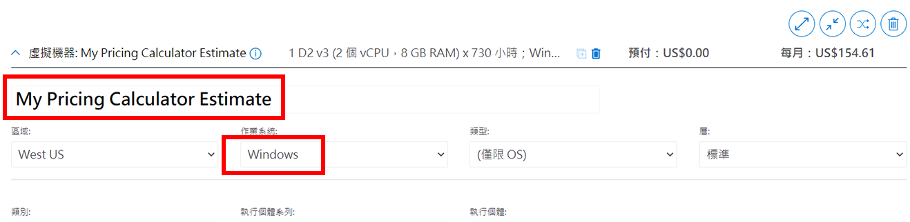

4. 修改預設 VM 設定。

    | 設定 | 值 |
    | -- | -- |
    | 區域 | **北歐** |
    | 作業系統 | **Windows** |
    | 類型 | **(僅 OS)** |
    | 層 | **標準** |  
    | 執行個體 | **A2：2 核心，3.5 GB RAM，135 GB 臨時儲存體** |

   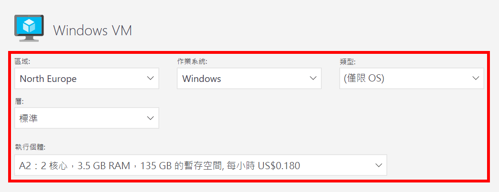

    **注意**：VM 執行個體的規格和定價可能與本範例中的不同。透過選擇與範例盡可能匹配的執行個體來完成本逐步解說。若要檢視有關其他 VM 產品選項的詳細資訊，請從右側的 [**更多資訊**] 選擇 [**產品詳細資訊**]。

5. 將 [**賬單選項**] 設定為 [**隨用隨付**]。

   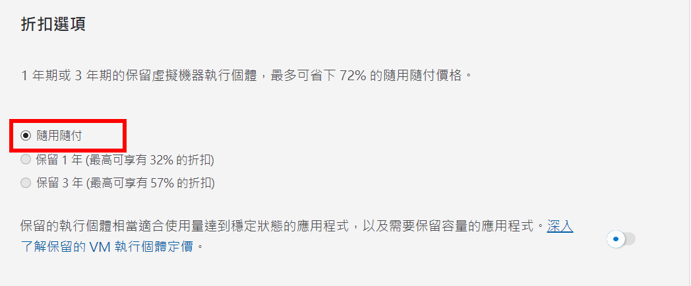

6. 在 Azure 中，一個月被定義為 730 小時。如果您的 VM 需要每月 100% 的時間可用，您可以將 [每月小時數] 值設定為 `730`。本逐步解說範例要求每個月有 50% 的時間有一個 VM 可用。

    將 [VM 數量] 設定為 `1`，並將 [每月小時數] 值更改為 `365`。

   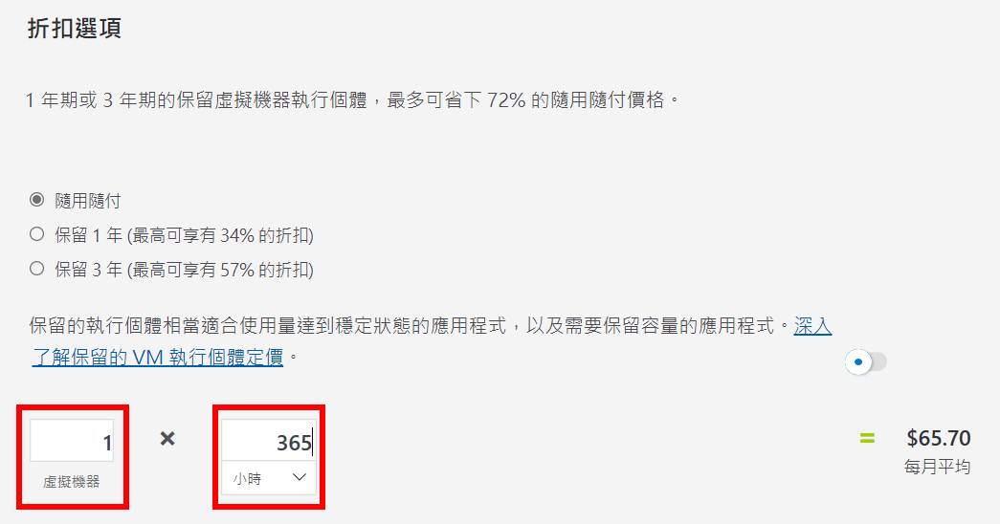

7. 在 [**受管理 OS 磁碟**] 窗格中，修改預設 VM 儲存體設定。

    | 層 | 磁碟大小 | 磁碟數量 | 快照集 | 儲存體交易數 |
    | ---- | --------- | --------------- | -------- | -------------------- |
    | 標準 HDD | S30： 1024 GiB | 1 | 關閉 | 10,000 |

   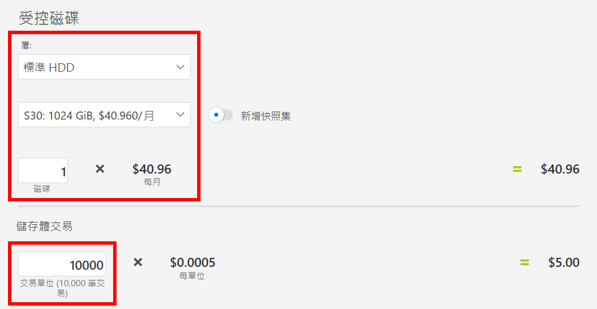

8. 若要新增估計的網路頻寬，請返回 Azure 定價計算機網頁的頂部。按一下左側產品功能表中的 [**網路**]，然後按一下 [**頻寬**] 磚。在 [**新增的頻寬**] 訊息對話方塊中，按一下 [**檢視**]。

   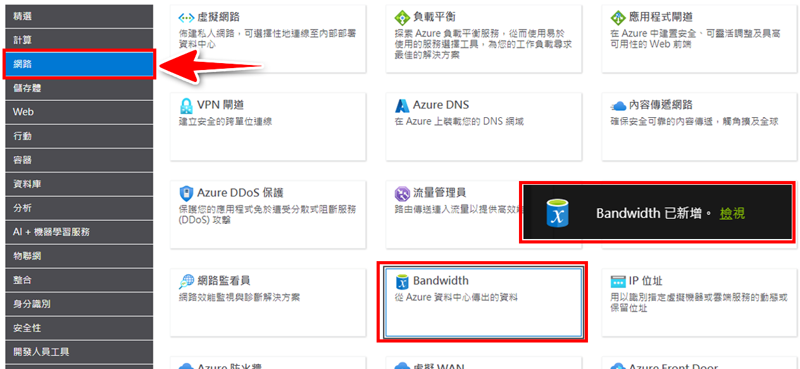

9. 為 VM 頻寬設定新增名稱。本逐步解說範例使用名稱 [**頻寬：Windows VM**]。透過新增下列詳細資訊來修改預設頻寬設定。

    | 區域 | 區域 1 輸出資料傳輸量 |
    | ------ | -------------------------------------- |
    | 北歐 | 50 GB |

   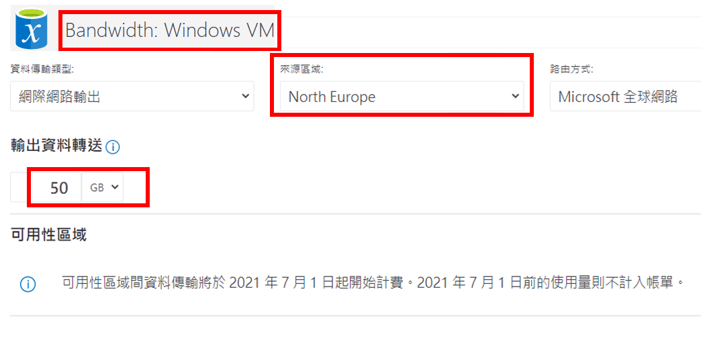

10. 若要新增應用程式閘道，請返回 Azure 定價計算機網頁的頂部。在 [**網路**] 產品功能表中，按一下 [**應用程式閘道**] 磚。在 [**應用程式閘道**] 訊息對話方塊中，按一下 [**檢視**]。

    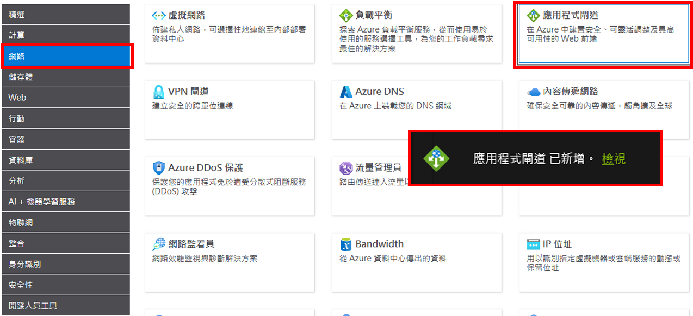

11. 為應用程式閘道設定新增名稱。該逐步解說使用名稱 [**應用程式閘道：Windows VM**]。透過新增下列詳細資訊來修改預設應用程式閘道設定。

    | 設定 | 值 |
    | -- | -- |
    | 區域 | **北歐** |
    | 層 | **基本** |
    | 大小 | **小型** |
    | 執行個體 | **1** |  
    | 小時 | **365** |
    | 處理的資料 | **50 GB** |
    | 區域 1：北美、歐洲 | **50 GB**|

    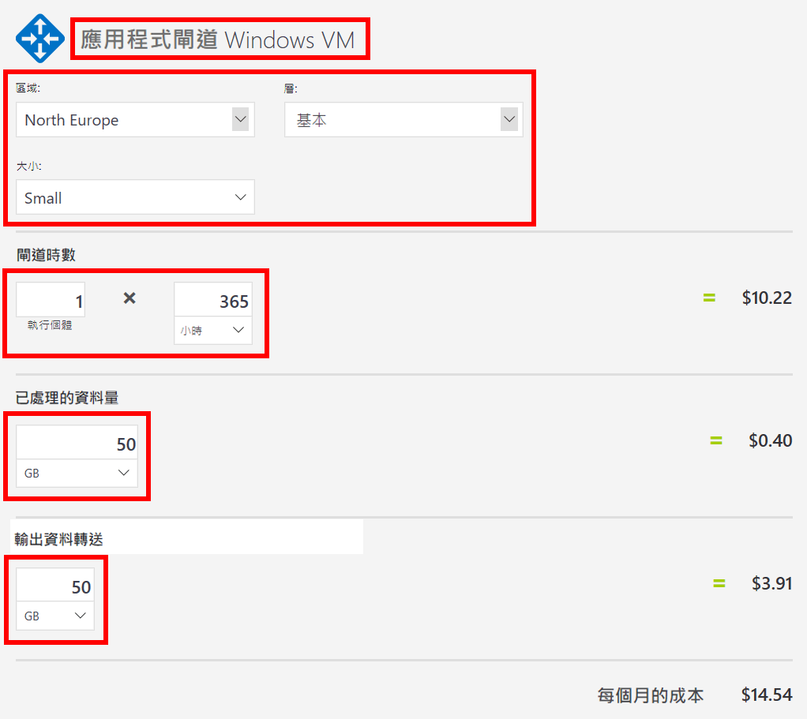

# 工作 2：檢閱定價估計

在本工作中，我們將檢閱 Azure 定價計算機的結果。 

1. 滾動到 Azure 定價計算機網頁的底部以檢視**每月估計的總成本**。

    **注意**：探索 Azure 定價計算機中提供的各種選項。例如，本逐步解說要求您將貨幣更新為歐元。

2. 將貨幣變更為歐元，然後選取 [**匯出**]，下載一份 Microsoft Excel (`.xlsx`) 格式的估計複本以供離線檢視。

    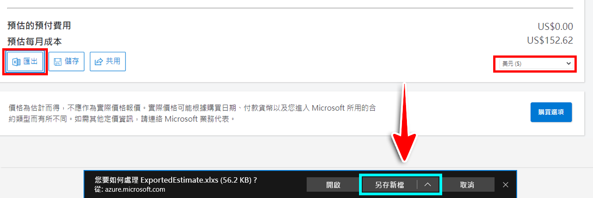

    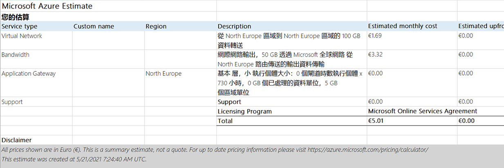

恭喜！您已從 Azure 定價計算機下載了一個估計。
